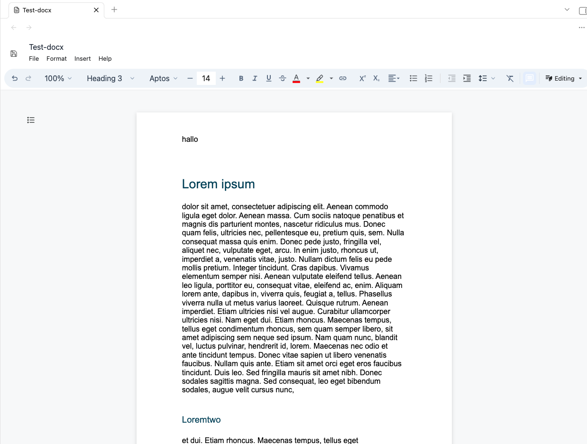
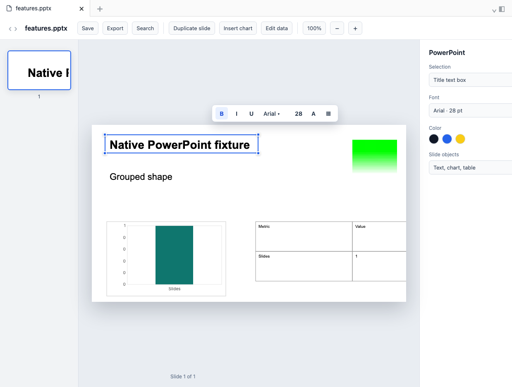

# Welcome to Native PowerPoint Doc Editor!

## What Native PowerPoint Doc Editor Does

Native PowerPoint Doc Editor opens, searches, and edits `.docx` and `.pptx` files directly inside your Obsidian vault without converting them to Markdown.

| DOCX editor | PowerPoint editor |
| --- | --- |
|  |  |

### Editing and viewing

- Opens DOCX files in a native document editor.
- Opens `.pptx`, `.pptm`, `.ppsx`, `.ppsm`, `.potx`, and `.potm` files in a PowerPoint-style slide editor.
- Edits and saves DOCX text, formatting, tables, images, and review markup.
- Edits supported PowerPoint text, tables, charts, shapes, slide objects, and chart data.
- Duplicates, exports, and saves supported documents under a new name.
- Detects save conflicts when an Office file changes on disk while it is open.

### Search and diagnostics

- Searches inside the current DOCX or PowerPoint file.
- Optionally builds a local vault-wide DOCX search index.
- Scans DOCX files for hidden or suspicious prompt-injection text.
- Keeps DOCX and PowerPoint file handling optional so another plugin can own either extension.

To start editing, open a supported Office file from the Obsidian file explorer. Use the editor toolbar or command palette for save, export, duplicate, search, and diagnostics. Plugin settings can disable DOCX or PowerPoint handling independently.

## Setup

### Quick Start

1. Open **Settings → Community plugins** in Obsidian.
2. Search for **Native PowerPoint Doc Editor**.
3. Install and enable the plugin.
4. Open a `.docx` or supported PowerPoint file from the file explorer.

### Manual Setup

1. Download `main.js`, `manifest.json`, and `styles.css` from the latest release.
2. Create `.obsidian/plugins/native-powerpoint-doc-editor` inside your vault.
3. Copy the three release files into that folder.
4. Reload Obsidian.
5. Enable **Native PowerPoint Doc Editor** under **Settings → Community plugins**.

For local development, install dependencies with `npm install`, build with `npm run build`, and copy the release artifacts to the same plugin folder. The `run-to-import` folder also contains local Windows and macOS installers.

## License

Licensed under the BSD Zero Clause License (`0BSD`).

## Network

The plugin is designed to work offline inside your vault. It has no telemetry, analytics, advertising, accounts, or self-updating code. Normal editing, search, save, and export do not upload vault contents.

Network access can occur only when you open an external link, activate a hyperlink stored in a document, or export a DOCX whose images reference remote URLs. Obsidian, your operating system, or the browser handles those requests.

Local data may include an optional DOCX search index, recovery copies, normal Obsidian plugin settings, and a developer debug log when a `.hotreload` marker exists. **Import font** and **Insert image** use a system file picker; **Copy debug log** writes only to the clipboard.

See [docs/privacy-policy.md](docs/privacy-policy.md) and [docs/terms-of-service.md](docs/terms-of-service.md).

## Commands

- `rebuild-docx-search-index` — rebuild the optional local DOCX search index.
- `find-in-current-docx` — find text in the open DOCX file.
- `find-replace-in-current-docx` — find and replace text in the open DOCX file.
- `search-docx-files` — search indexed DOCX files across the vault.
- `save-current-docx` — save the open DOCX file.
- `save-current-docx-as` — save the open DOCX file under another name.
- `duplicate-current-docx` — duplicate the open DOCX file.
- `copy-debug-log` — copy the in-memory diagnostic log.
- `open-powerpoint-file` — choose and open a supported PowerPoint file.
- `save-current-powerpoint-file` — save the open PowerPoint file.

## Changelog

See [CHANGELOG.md](CHANGELOG.md) for release history.

## Development

See [CONTRIBUTING.md](CONTRIBUTING.md) for contribution, setup, testing, and release guidance.
