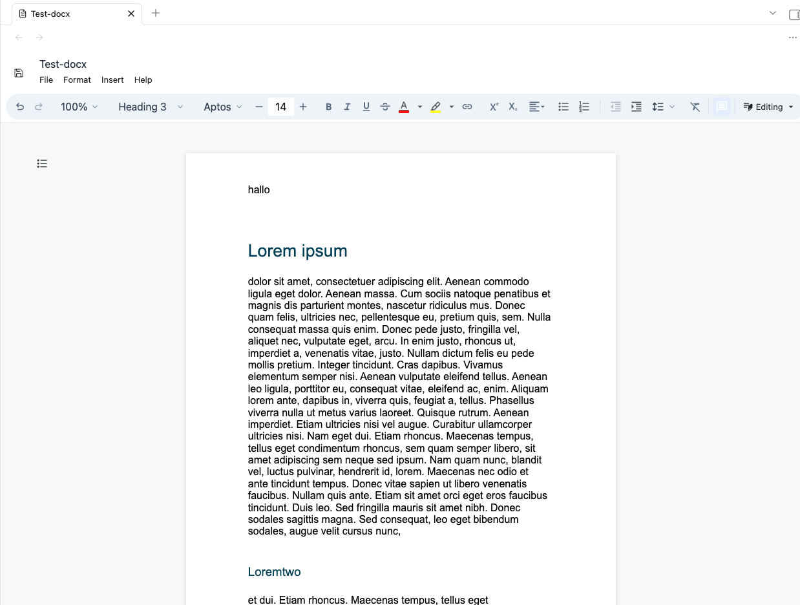
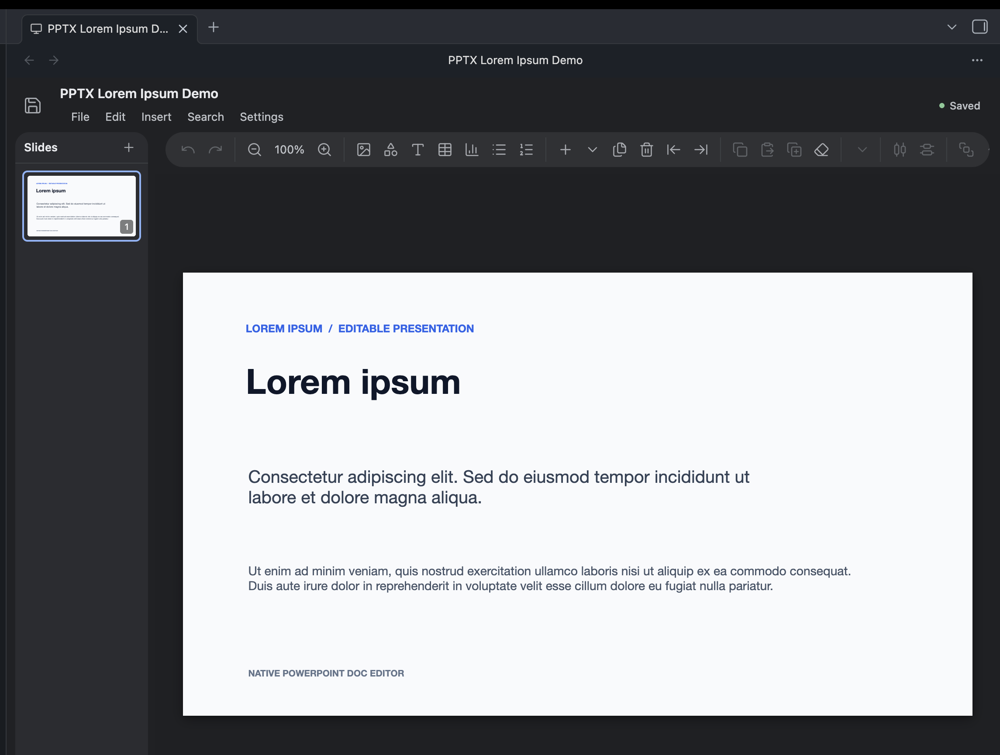

# Welcome to Native PowerPoint Doc Editor!

## What Native PowerPoint Doc Editor Does

Native PowerPoint Doc Editor opens, searches, and edits `.docx` and `.pptx` files directly inside your Obsidian vault without converting them to Markdown. It is insane to think there was no well built functionality for this. This plugin was partly made with spite.

| DOCX editor | PowerPoint editor |
| --- | --- |
|  |  |

### Editing and viewing

- Opens DOCX files in a native document editor.
- Opens `.pptx`, `.pptm`, `.ppsx`, `.ppsm`, `.potx`, and `.potm` files in a PowerPoint-style slide editor.
- Edits and saves DOCX text, formatting, tables, images, and review markup.
- Edits supported PowerPoint text, tables, charts, shapes, slide objects, and chart data.

## Setup

### Quick Start

1. Open **Settings → Community plugins** in Obsidian.
2. Search for **Native PowerPoint Doc Editor**.
3. Install and enable the plugin.
4. Open a `.docx` or supported PowerPoint file from the file explorer.

### Manual Setup

1. Download the BRAT plugin
2. Press on its icon to enter a plugin, and paste in https://github.com/MarsLuay/NativePowerPointDocEditor
3. Select any release you desire! (the latest pre-release is my pick..)
4. Press install and enjoy

## If you want..

If you like what I've made, I would deeply appreciate a donation to my https://buymeacoffee.com/marwanluaye! I need to support a coffee addiction but have to spend my spare money on silly things like a college education

## License

Licensed under MIT.

Feel free to build cool things with this as a base, just make sure to give some acknowledgement to your beautiful dev.

## Network

The plugin is designed to work offline inside your vault. It has no telemetry, analytics, advertising, accounts, or self-updating code. Normal editing, search, save, and export do not upload vault contents.

Network access can occur only when you open an external link, activate a hyperlink stored in a document, or export a DOCX whose images reference remote URLs. Obsidian, your operating system, or the browser handles those requests.

Local data may include an optional DOCX search index, recovery copies, normal Obsidian plugin settings, and a developer debug log when a `.hotreload` marker exists. **Import font** and **Insert image** use a system file picker; **Copy debug log** writes only to the clipboard.

See [docs/privacy-policy.md](docs/privacy-policy.md) and [docs/terms-of-service.md](docs/terms-of-service.md).
